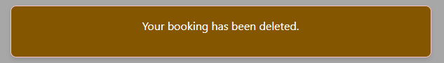

# **Onyx | Gym**

This website was created as the 3rd Milestone Project for Code Institute's web application development course.

[**__link to deployed site here__**](https://gym-onyx-cce045b2bb54.herokuapp.com/)
<br><br>


<br><br>

# Contents

* [User Experience](#user-experience-ux)
    * [Owner Goals](#owners-goals)
    * [Visitor Goals](#visitor-goals)
* [Design](#design)
    * [Wireframes](#wireframes)
    * [Database Schema](#database-schema)
    * [Materialize](#materialize)
    * [Images](#images)
* [Features](#features)
    * [Multi-page Features](#multi-page-features)
    * [All User Features](#all-user-features)
    * [Member Level Features](#member-level-features)
    * [Trainer Level Features](#trainer-level-features)
    * [Admin Level Features](#admin-level-features)
    * [Member/Trainer/Admin Level Features](#membertraineradmin-level-features)
    * [Error Pages](#error-pages)
    * [CRUD Functionality](#crud-functionality)
    * [Future Implementation](#future-implementation)
* [Technologies](#technologies)
    * [Languages](#languages)
    * [Tools](#tools)
* [Testing](#testing)
* [Deployment](#deployment)
    * [Deployment to Heroku](#deployment-to-heroku)
    * [Forking Repository](#forking-the-github-repository)
    * [Make Local Clone](#making-a-local-clone)
    * [Version Control](#version-control)
* [Credits](#credits)

<br><br>

# User Experience

A local gym "Onyx Gym" required a website so new and current memebers can booked on to the classes that they offer
<br><br>

## Owners Goals
As a gym administrator I can create new classes so that members can book them
- A form to add class details (name, date, time, description etc..)
- Validation for required fields.
<br><br>

As a gym administrator I can view and manage all bookings so that issues or conflicts can be handled.
- A page listing all bookings with class details
- Option to cancel a booking for any member.
<br><br>

As a gym administrator I can delete a class so that it can not be booked if it is no longer offered
- A "Delete" button next to each class in the admin panel.
- Confirmation prompt before deletion.
<br><br>

As a gym administrator I can edit class information so that update if any changes occur
- An "Edit" button next to each class in the admin panel.
- Changes are saved and updated in real-time.

## Visitor Goals
As a gym member I can view a schedule of all available classes so that decide which class to attend.
- A page displaying the class name, date, time, duration
- Classes are listed in chronological order.
<br><br>

As a visitor I can ** create an account** so that book and manage classes.
- A "Sign Up" page with a registration form
- A "Sign Up" page with a registration form
<br><br>

As a gym member I can book a spot so that I can participate.
- A "Book Now" button next to each class.
- A "Book Now" button next to each class.
<br><br>

As a gym member I can see a list of the classes I have booked so that I can manage my schedule
- A "My Bookings" page with class details.
- Ability to edit upcoming bookings.
<br><br>

As a gym member I can cancel a booking so that no longer attend the class
- A "Delete Booking" button in the "My Bookings" section.
- Confirmation prompt before cancellation
<br><br>

# Design

## WireFrames 

I used figma to create my wireframes which are located below


<summary>Desktop</summary>
<br>

<br>
<summary>Tablet</summary>
<br>

<br>
<summary>Mobile</summary>
<br>

<br>
<br><br>

## Database Schema

Schema for PostgreSQL database was created on [Diagrams.net](https://app.diagrams.net/)

<summary>DB Schema</summary>
<br>

<br><br>

## Images 

All images were sourced from [Unsplash](https://unsplash.com/)
<br><br>


# Features

## Navbar

The navbar is present across all pages ecxept for custom pages to catch errors. On mobile devices collapses to a hamburger icon which opens as a sidenav. The links visible are dependant on if the user is logged in.

<summary>Navbar signed in</summary>
<br>

<br><br>
<summary>Navbar signed out</summary>
<br>


## Footer
Footer is present across all pages ecxept for custom pages to catch errors, with links to gyms potenial socials.

<br>


## Modals

Modals are present wherever a delete button is clicked to defend against accidental deletion and to show class description.

<summary>Class Description</summary>
<br>

<br><br>
<summary>Delete Confirmation</summary>
<br>


## Messages

Message appear om the screen to let the user know a certain action has been furfilled. This confirming they have signed in or out and the status of thier bookings.

<summary>Signed In</summary>
<br>

<br><br>
<summary>Signed Out</summary>
<br>

<br><br>
<summary>Which user logged in</summary>
<br>

<br><br>
<summary>Edit booking</summary>
<br>

<br><br>
<summary>Delete booking</summary>
<br>

<br><br>
<summary>Booking confirmed</summary>
<br>

<br><br>
<summary>No bookings</summary>
<br>

<br><br>

## Log In 

Log in form is rendered and checks for user in database and password correct. Prompt on form if not already registered with link to register page.


<br><br>

## Log Out

Log out functionality available to all logged in users, simply clears all session cookies.


<br><br>

## Register

Form is rendered to register for the site, checks if user is already in database, if not adds them to database. Prompt on the form if already registered with link to Log In page.


<br><br>

## Homepage

Homepage is available to all users where they can see all the class that are avaiable with the desciption, date, time, cost and button to book on to the class. If more than 6 classes are avaible there is a pagination to take you to the next page of classes.

<summary>Classes</summary>
<br>

<br><br>
<summary>Pagination</summary>
<br>

<br><br>

## Create a booking page

This is the page the user is directed to once they click creare a booking on the class they wish to attened. If not logged in the user will be promted to login. The user will be asked to input their first, last name, email(optional) thier experice level and a text area if they need to inform the member of staff taking the class of any issue.


<br><br>

## My Bookings Page

This is the page the user is directed to once they have made their booking, this can also be done from a link in the navbar and also a view my booking button above the list classes. Here the user can view there upcoming classes and make any updates to thier booking or delete the booking if no longer can attend.

<summary>My bookings</summary>
<br>

<br><br>
<summary>Edit booking</summary>
<br>


## Error Pages

### 404 Page

In the event of a page not found the error handler will render a page with a link back to the homepage.


<br><br>

### 500 Page

In the event of a bad response from the server the error handler will render a page with a link back to the homepage.


<br><br>

## CRUD Functionality

| Page         | Create                                                  | Read                                                                                 | Update                                                 | Delete                                                                |
| ------------ | ------------------------------------------------------- | ------------------------------------------------------------------------------------ | ------------------------------------------------------ | --------------------------------------------------------------------- |
| Login        |                                                         | Read username for password check                                                     |                                                        |                                                                       |
| Register     | Create new User | Read username to check if User exists                                                |                                                        |                                                                       |
| My Bookings  |                                                         | View all currently booked classes for user in date order                                          | Functionality to edit booked classes                  | Functionality to delete booked classes                               |
| Book a class | Create a new booking for a class                      |                  |                                                        |                                                                       |

## Future Implementation
Planned for future, the custoemr could pre pay for the class ahead of time through the webiste instead of paying at the front desk. They could buy and add credits to thier account, e.g 10 credits to be redeemed on upto 10 class in the future. When the customer signs up they could choose a memebership plan, 3,6 or 12 month options and have the memebership fee taken automatically out of their account each month.

# Technologies

## Languages

* HTML5 - for content and structure.
* CSS3 - for styling.
* Vanilla JS - for initialization of materialize components and for functions that request and handle data from the backend.
* Python - for the backend functionality.
* All other assets used:
    - asgiref==3.8.1
    - cloudinary==1.36.0
    - dj-database-url==0.5.0
    - dj3-cloudinary-storage==0.0.6
    - Django==4.2.17
    - django-allauth==0.57.2
    - oauthlib==3.2.2
    - psycopg2==2.9.10
    - PyJWT==2.10.
    - requests-oauthlib==2.0.0
    - sqlparse==0.5.3
    - urllib3==1.26.20
    - whitenoise==5.3.0
    
<br><br>

## Tools

* Figma - used to create wireframes.
* Diagrams.net - used to create DB schema.
* Am I Responsive - used to create responsive mockup for readme.
* Google Dev Tools - used for troubleshooting during development.
* Git/Github - used for version control and storage.
* Heroku - used for deployment.
<br><br>

# Testing

For testing please the [Testing](/TESTING.md) documentation.
<br><br>

# Deployment

## Deployment to Heroku

To deploy to Heroku:
1. In GitPod CLI, the root directory of the project, run:
    pip3 freeze --local > requirements.txt
    to create a requirements.txt file containing project dependencies.
2. In the Gitpod project workspace root directory, create a new file called Procfile, with capital 'P'.
    Open the Procfile. Inside the file, check that web: python3 app.py has been added when creating the file
    Save the file.
3. Push the 2 new files to the GitHub repository
4. Login to Heroku, select Create new app, add the name for your app and choose your closest region.
5. Navigate to the Deploy tab on Heroku dashboard and select Github, search for your repository and click 'connect'.
6. Navigate to the settings tab, click reveal config vars and input the following:

| Key | Value |
| :---: | :---: |
| DATABASE_URL | postgresql |
| IP | 0.0.0.0 |
| PORT | 5000 |
| SECRET_KEY | mysecretkey |

Actual Enviroment variables not disclosed for security.

## Forking the GitHub Repository
<br>

By forking the GitHub Repository we make a copy of the original repository on our GitHub account to view and/or make changes without affecting the original repository by using the following steps...

1. Log in to GitHub and locate the [GitHub Repository](https://github.com/)
2. At the top of the Repository (not top of page) just above the "Settings" Button on the menu, locate the "Fork" Button.
3. You should now have a copy of the original repository in your GitHub account.
<br><br>

## Making a Local Clone
<br>

1. Log in to GitHub and locate the [GitHub Repository](https://github.com/)
2. Under the repository name, click "Clone or download".
3. To clone the repository using HTTPS, under "Clone with HTTPS", copy the link.
4. Open Git Bash
5. Change the current working directory to the location where you want the cloned directory to be made.
6. Type `git clone`, and then paste the URL you copied in Step 3.

```
$ git clone https://github.com/YOUR-USERNAME/YOUR-REPOSITORY
```

7. Press Enter. Your local clone will be created.

```
$ git clone https://github.com/YOUR-USERNAME/YOUR-REPOSITORY
> Cloning into `CI-Clone`...
> remote: Counting objects: 10, done.
> remote: Compressing objects: 100% (8/8), done.
> remove: Total 10 (delta 1), reused 10 (delta 1)
> Unpacking objects: 100% (10/10), done.
```
<br><br>

## Version Control

Workflow controlled using Git and GitHub. It helps you track different versions of your code and collaborate with other developers. Version control allows you to keep track of your work and helps you to easily explore the changes you have made.

You can think of a repository as a “main folder”, everything associated with a specific project should be kept in a repo for that project.
You will have a local copy (on your computer) and an online copy (on GitHub) of all the files in the repository.

Once Changes on your local copy have been saved they can be added to the staging area using ```Git -add```. And then commited using ```Git commit``` along with your message, meaning they will be saved as a version of the repository which is then ready to be pushed, using ```Git push```, up to the online copy of your repository.
<br><br>

# Credits

All photos for the auto-slider on the homepage were sourced from [Unsplash](https://unsplash.com/).