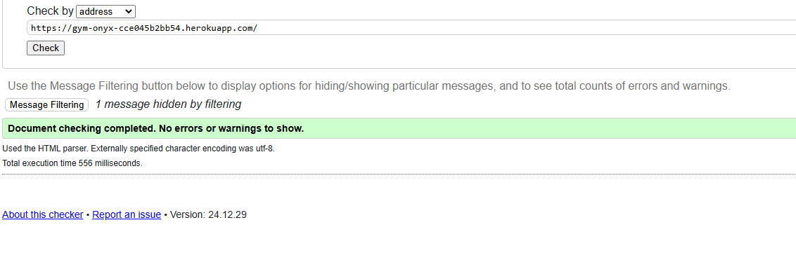
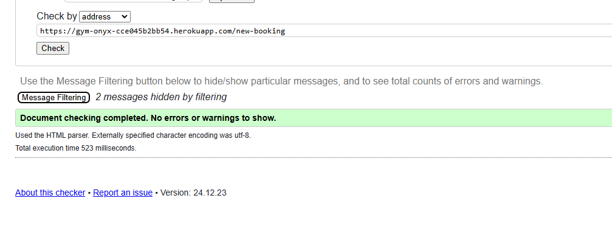
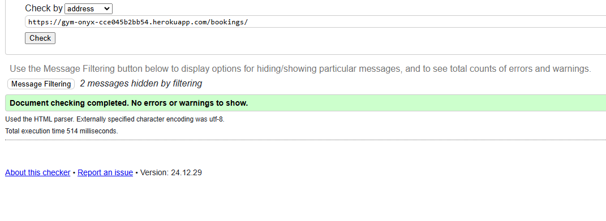
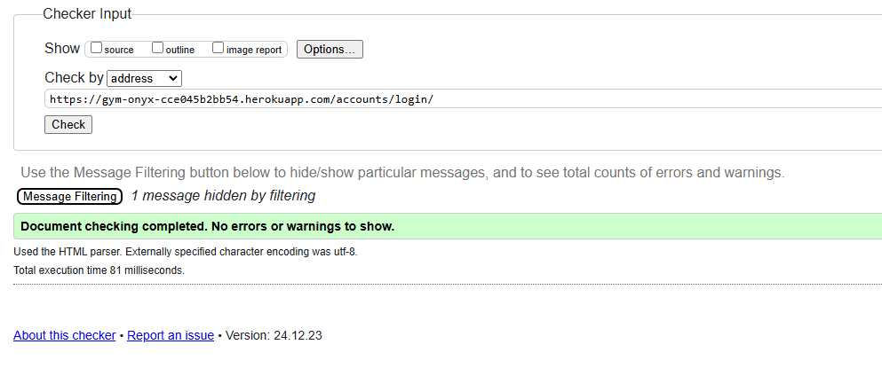
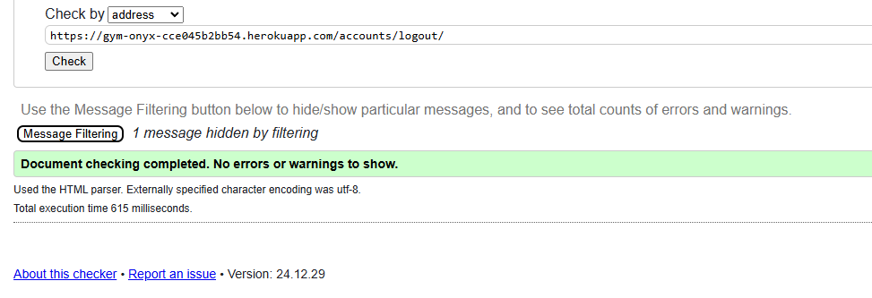
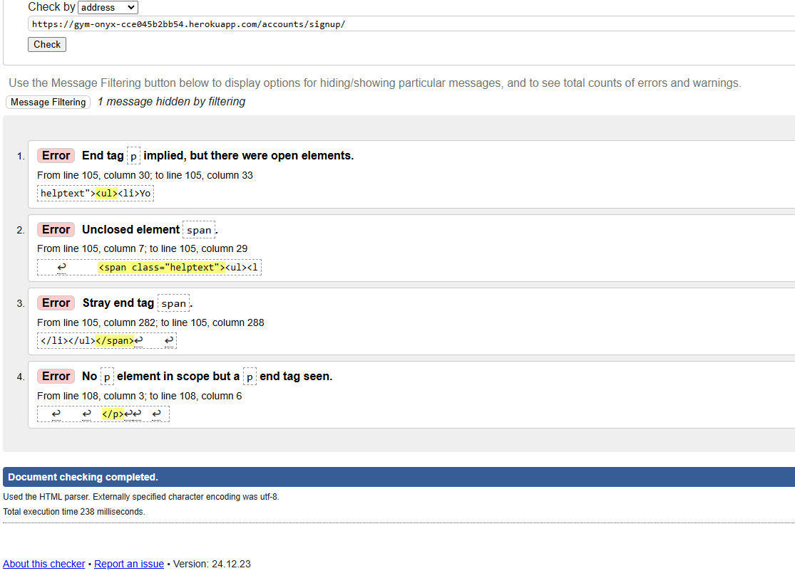
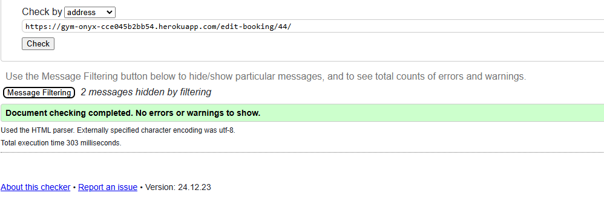
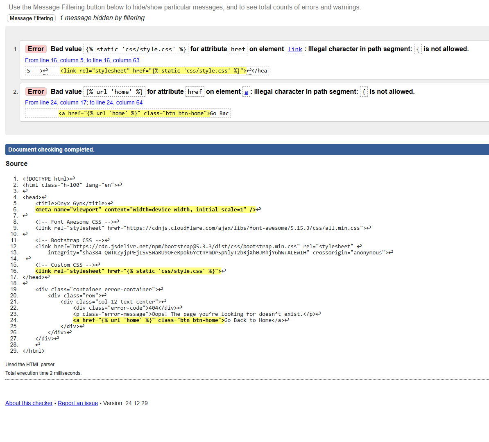
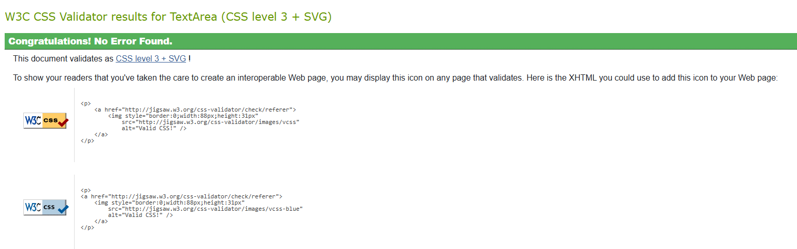
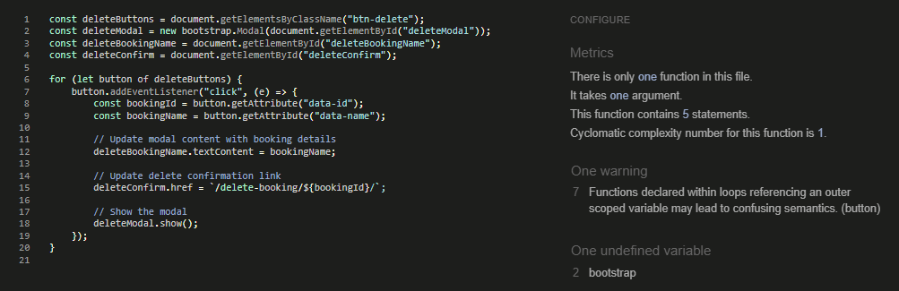

  

# Testing documentation for Onyx | Gym Web application.
  

# Contents

* [Validation](#validation)
    * [HTML Validation](#html-validation)
    * [CSS Validation](#css-validation)
    * [JS Validation](#js-validation)
    * [CI Python Linter](#ci-python-linter)
    * [Lighthouse](#lighthouse)
    * [WAVE Accessibility](#wave-accessibility-checker)
* [User Story Testing](#user-story-testing)
    * [General](#general)
    * [Logged Out](#logged-out)
    * [Member User](#member-user)
    * [Employee/PT User](#employeept-user)
    * [Managment User](#management-user)
* [Manual Testing](#manual-testing)
* [Responsiveness](#responsiveness)

  

# Validation

## HTML Validation

All pages pass HTML Validation at [W3C markup validation service](https://validator.w3.org/) with no site breaking errors or warnings. 

Homepage

 

Create a Booking

 

My Bookings

 

Log In

 

Log Out

 

Register

 
There was 4 errors on the registar html do to the html format used by allauth that I can not chanage, this is something I look to update myself in the future.
 

Edit Booking

 

404 Error

 
Had to check the code manually for this one as checking via url would bring up IO Error: HTTP resource not retrievable. There are 2 errors showing due to it not liking the Django syntax for links. Otherwise all working correctly with no working issues.
 

500 Error

 

  

## CSS Validation

All pages pass CSS Validation at [W3C CSS validation service](https://jigsaw.w3.org/css-validator/) with no errors or warnings.

CSS Validation

 

  

## JS Validation

Custom JS script file run through [JShint](https://jshint.com/) for validation. Shows one undefined but as this is part of the script get bootstap modal to work and one warning I have chosen to ignore these as the components work as expected.

JS Validation

 

  

## CI Python Linter

models.py

 

 

views.py

 

 

urls.py

 

 

form.py

 

  

